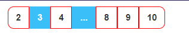

# Version: 1.1.0




## Configure

| parameter            | Description                                             |
| -------------------- | ------------------------------------------------------- |
| pageHandle           | page Handler (function)                                 |
| current_page         | pass current page. `number`                             |
| lastPage             | pass lastPage page. `number`                            |
| disableButtonColor   | Disable button color . `string`. Default: "#3ABFF8"     |
| buttonBgColor        | Each button color.  `string`. Default: 'blue'           |
| buttonTextColor      | Each text color. `string`. Default: 'black'             |
| buttonTextHoverColor | When hover text color change. `string`.Default: 'white' |
| buttonHoverColor     | Each Button Hover color. Default: "blue"                |
| borderColor          | Border color.`string`. Default: "blue"                  |
| borderWidth          | Border width. (px) `number`. Default: 1                 |
| buttonSize           | Button size. (px) `number`.Default: 32                  |
| font                 | Font size. (px) `number` . Default: 14                  |


``` javascript
import Pagination from 'react-nextjs-pagination'


const Test=()=>{

    const [getPage, setPage] = useState(1);
    const [show, setShow] = useState(10);
    const [lastPage, setLastPage] = useState(0)

    const totalFiles = 100;
    useEffect(() => { 
        const lastPage =  Math.ceil(totalFiles / show); // lastPage = 10
        setLastPage(lastPage)
    }, [])

    const pageHandle = (jump) => {
        setPage(jump)
    }
    return(
        <div>
            <Pagination 
                lastPage={lastPage} 
                current_page={getPage} 
                pageHandle={pageHandle}
            />
        </div>
    )
}
```

## Add css file:

Add css file in `index.js` (for react) or `_app.js/ _app.ts` (for nextjs)

```js
import 'react-nextjs-pagination/pagination.css'
```